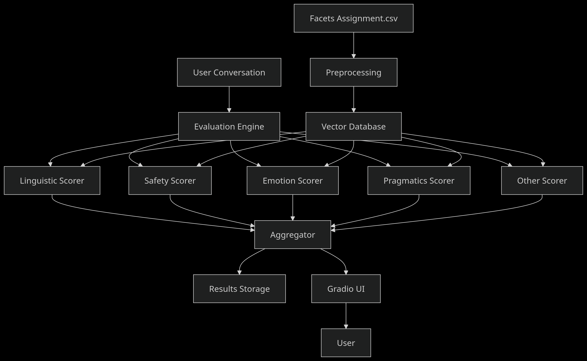

Here's a comprehensive README.md file for your Conversation Evaluation System assignment:

```markdown
# Ahoum - Conversation Evaluation System

## Overview
This project implements a production-ready benchmark for evaluating conversations against 300+ distinct psychological facets covering linguistic quality, pragmatics, safety, and emotion. The system uses open-weights LLMs (Llama 3) and a vector database (Qdrant) to handle large-scale facet evaluation efficiently.

## Key Features
- 🧠 **Multi-facet evaluation** - Scores conversations on 300+ psychological dimensions
- 🚀 **Scalable architecture** - Supports up to 5000 facets without redesign
- 📊 **Confidence scoring** - Provides confidence metrics for each evaluation
- 🔍 **Semantic search** - Vector-based facet retrieval system
- 🎯 **Specialized scoring agents** - Category-specific evaluators (Linguistic, Safety, etc.)
- 📈 **Health monitoring** - Conversation health index visualization
- 🚨 **Critical issue detection** - Identifies high-risk conversation elements
- 💻 **Interactive UI** - Gradio-based interface for testing and analysis

## Architecture
 

## Technical Specifications
- **LLM Models**: Llama 3 (8B) via Ollama
- **Embeddings**: Nomic v1.5
- **Vector Database**: Qdrant
- **Core Libraries**: LangChain, Gradio, Qdrant Client
- **Scalability**: Tested with 300+ facets, designed for 5000+
- **Output**: Scores (1-5) with confidence metrics (0.0-1.0)

## Installation

### Prerequisites
- Python 3.10+
- Docker
- Ollama (with Llama 3 and Nomic models)

### Setup
1. Clone repository:
   ```bash
   git clone https://github.com/yourusername/conversation-evaluator.git
   cd conversation-evaluator
   ```

2. Download models:
   ```bash
   ollama pull llama3.2
   ```
   (Ps: I used Llama3.2 as i had it on my system but for better output use higher model with >=8b parameters)

3. Start Qdrant database:
   ```bash
   docker run -p 6333:6333 -p 6334:6334 qdrant/qdrant
   ```

4. Initialize facet database:
   ```bash
   python main.py --init
   ```

## Usage

### Run the UI:
```bash
python main.py
```

### Access the UI:
Open `http://localhost:7860` in your browser

### UI Features:
1. **Conversation Tab**:
   - Build conversations using speaker/text inputs
   - Select facet categories for evaluation
   - Set health index threshold

2. **Results Tab**:
   - Health index gauge visualization
   - Critical issues table
   - Facet scores by turn
   - Raw JSON output

3. **Facet Explorer**:
   - Semantic search across all facets
   - Category distribution charts
   - Detailed facet metadata inspection

### Programmatic Usage:
```python
from evaluator import ConversationEvaluator
from qdrant_client import QdrantClient

# Initialize evaluator
vector_db = QdrantVectorDB()
evaluator = ConversationEvaluator(vector_db)

# Evaluate conversation
conversation = [
    {"speaker": "User", "text": "I'm feeling depressed"},
    {"speaker": "AI", "text": "I'm sorry to hear that"}
]
results = evaluator.evaluate_conversation(conversation)
```

## Dataset Processing
The system processes `Facets Assignment.csv` through:
1. Normalization (removing prefixes, snake_case conversion)
2. Metadata generation (scoring guidelines, external data flags)
3. Semantic categorization (Linguistic, Pragmatics, Safety, Emotion, Other)
4. Vector embedding storage

## Deliverables Checklist
- [x] GitHub repository with documentation
- [x] Dockerized baseline (Qdrant)
- [x] Sample UI (Gradio)
- [x] Support for 300+ facets
- [x] Confidence outputs for scores
- [x] Sample evaluation results (in `results/` directory)

## Scalability Design
The architecture supports 5000+ facets through:
- Batch processing at all stages (preprocessing, categorization, scoring)
- Vector similarity search for efficient facet retrieval
- Specialized scoring agents operating in parallel
- Memory-optimized data structures
- Asynchronous operations

## Future Enhancements
1. Add Dockerfile for full containerization
2. Implement parallel scoring agents
3. Add user authentication
4. Enhance visualization with Plotly dashboards
5. Implement continuous evaluation pipeline

PS: Due to time contraints only this much is possible
